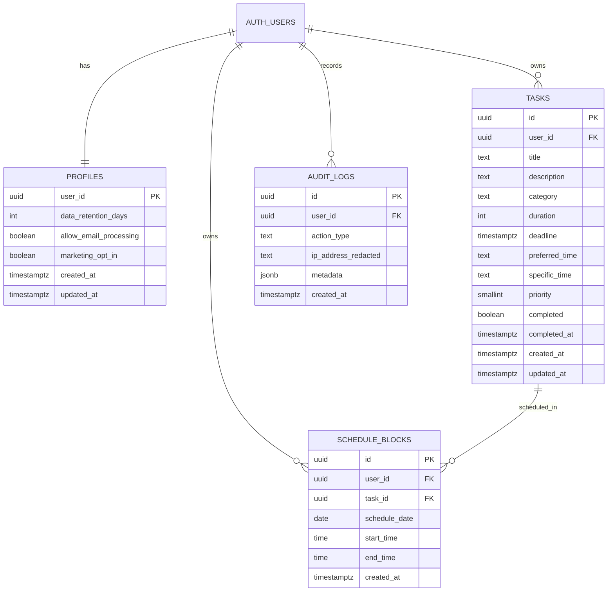
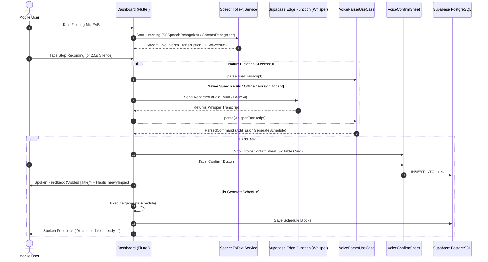

# CaliMind — Mobile Product Requirements Document (PRD)

**Project Name:** CaliMind  
**Platform Target:** Mobile iOS (16.0+) & Android (12.0+ / API 31+)  
**Technology Stack:** **Flutter 3.24+ (Dart 3.5+)**  
**Document Version:** 2.0.0 (Flutter & Dart Native Edition)  
**Status:** Approved for Implementation  
**Primary Reference Web Implementation:** TanStack Start + Supabase Web App  

---

## 1. Executive Summary & Vision

### 1.1 Product Mission
**CaliMind** is a voice-first daily task planner and intelligent scheduling assistant built for individuals managing multi-faceted responsibilities (such as Student Leaders, Class Representatives, Club Presidents, and Active Students). 

Rather than requiring tedious manual data entry, CaliMind allows users to capture tasks by speaking naturally. The application transcribes speech, infers context and operational roles, presents a rapid confirmation interface, and computes a deterministic, conflict-free, priority-weighted daily schedule with intelligent 15-minute buffers.

### 1.2 The Flutter & Dart Advantage
Choosing **Flutter and Dart** delivers:
- **60/120 FPS Fluid Animations:** Direct Skia/Impeller rendering pipeline delivers silky-smooth mic pulsing animations, wave visualizers, and hero transitions on iOS and Android.
- **Single Dart Codebase:** Unified business logic, domain models, scheduling algorithms, and UI widgets without platform drift.
- **Hardware Integration via Native Plugins:** Direct bridges to Apple Speech framework, Android SpeechRecognizer, `AVAudioSession`, biometric authentication (FaceID/Fingerprint), and native share sheets.
- **Strongly Typed Determinism:** Dart 3.5's pattern matching, records, sealed classes, and sound null-safety ensure that scheduling calculations and voice parsing are 100% bug-free and reproducible offline.

---

## 2. Core Target Personas

| Persona | Real-World Context | Mobile Pain Point | CaliMind Mobile Solution |
| :--- | :--- | :--- | :--- |
| **Alex — Class Rep & Student Leader** | Coordinates lectures, coursework updates, professor notices, and student inquiries. | Always on the move; typing details between lectures is too slow; needs to broadcast updates. | Instant voice capture (*"Add class rep meeting tomorrow for 30 min priority 1"*); one-tap **Native Share Sheet** to forward announcements to WhatsApp/Telegram. |
| **Maya — Club President** | Manages budget sheets, executive meetings, sponsorships, and events. | Context switching causes tasks to get lost across fragmented notes and chat apps. | **Role Focus Bar** instantly isolates Club tasks from personal tasks; visual category badges (`#D946EF`). |
| **Jordan — Intensive Student** | Prepares for exams while balancing health and personal commitments. | Burnout caused by booking unrealistic 4-hour cramming sessions without breaks. | **Automated 120-minute Study Capping** with mandatory 15-minute buffers; intelligent time-of-day slotting. |

---

## 3. Core Architectural Principles

1. **Voice-First, Fallback-Complete:** Voice capture is the primary speed accelerant, but every action is backed by an intuitive, full-featured manual UI with bottom sheets and date-time wheel pickers.
2. **Explicit Confirmation Over Silent Magic:** Captured speech is parsed into a structured draft and shown in an editable **Voice Confirmation Bottom Sheet** before saving to the database. The system never creates phantom tasks.
3. **Pure Deterministic Scheduling:** The scheduler never uses opaque AI "black boxes". It executes a clean, mathematical constraint-satisfaction algorithm with 15-minute buffers, respecting explicit deadlines and preferred windows, and **always explains why** an unscheduled task could not fit.
4. **Calm Dark Slate Aesthetic:** A tranquil dark-slate visual system (`#12161F` / `#191E2B`) with vibrant indigo-to-teal gradients and role-coded accents. Designed to lower cognitive load and digital anxiety.
5. **Privacy & Security by Design:** Two-Factor Authentication (TOTP MFA), biometric app lock (FaceID/TouchID), strict Supabase Row Level Security (RLS), automated completed-task retention purging, and tamper-resistant audit logs.

---

## 4. Mobile System Architecture & Flutter Tech Stack

### 4.1 Recommended Flutter Ecosystem (`pubspec.yaml`)

```yaml
name: calimind
description: "Voice-first daily task planner & AI scheduling assistant."
publish_to: "none"
version: 1.0.0+1

environment:
  sdk: ">=3.5.0 <4.0.0"
  flutter: ">=3.24.0"

dependencies:
  flutter:
    sdk: flutter
  flutter_localizations:
    sdk: flutter

  # State Management & Architecture
  flutter_riverpod: ^2.5.1
  riverpod_annotation: ^2.3.5

  # Routing & Navigation
  go_router: ^14.2.0

  # Backend & Database
  supabase_flutter: ^2.8.0

  # Voice & Audio Hardware
  speech_to_text: ^7.0.0          # Native iOS SFSpeechRecognizer & Android SpeechRecognizer
  record: ^5.2.0                  # Fallback high-fidelity audio recorder for Whisper API
  flutter_tts: ^4.2.0             # Native Text-To-Speech audio feedback
  audioplayers: ^6.1.0            # Sound effects & feedback chimes

  # Hardware & Native Features
  local_auth: ^2.3.0              # Biometric unlock (FaceID / Fingerprint)
  flutter_secure_storage: ^9.2.2  # Encrypted iOS Keychain / Android EncryptedSharedPrefs
  share_plus: ^10.1.0             # Native OS share dialog for announcements
  flutter_local_notifications: ^18.0.0 # Reminders & task schedule alerts
  url_launcher: ^6.3.0

  # UI, Icons, Typography & Motion
  google_fonts: ^6.2.1            # Space Grotesk, Inter, JetBrains Mono
  lucide_icons: ^0.354.0          # Lucide icons matching web application
  flutter_animate: ^4.5.0         # Micro-interactions & mic-pulse animations
  intl: ^0.19.0                   # Date formatting and localization

dev_dependencies:
  flutter_test:
    sdk: flutter
  flutter_lints: ^4.0.0
  build_runner: ^2.4.11
  riverpod_generator: ^2.4.2
  custom_lint: ^0.6.4
  riverpod_lint: ^2.3.10
```

### 4.2 Clean Layered Architecture (`lib/` Directory Structure)

Following Flutter architectural best practices, the application isolates presentation, state management, and data access:

```text
lib/
├── main.dart                          # App entry point, Supabase initialization, ProviderScope
├── app.dart                           # MaterialApp.router, CaliMindTheme, GoRouter config
├── core/
│   ├── constants/
│   │   ├── app_colors.dart            # Hex color tokens, gradients, category colors
│   │   ├── app_typography.dart        # Space Grotesk & Inter text styles
│   │   └── schedule_constants.dart    # Day start/end (08:00 - 22:00), buffers, caps
│   ├── network/
│   │   └── supabase_client.dart       # Supabase client singleton & auth interceptor
│   ├── services/
│   │   ├── audio_recorder_service.dart # Fallback M4A recording service
│   │   ├── biometric_service.dart     # LocalAuth FaceID wrapper
│   │   ├── speech_recognition_service.dart # speech_to_text native engine
│   │   └── tts_service.dart           # flutter_tts spoken audio synthesizer
│   └── utils/
│       ├── date_time_utils.dart       # HH:mm, ISO-8601 formatting helpers
│       └── haptic_feedback_utils.dart # Haptic feedback triggers
├── data/
│   ├── datasources/
│   │   ├── audit_remote_datasource.dart
│   │   ├── profile_remote_datasource.dart
│   │   ├── schedule_remote_datasource.dart
│   │   └── task_remote_datasource.dart
│   └── repositories/
│       ├── profile_repository_impl.dart
│       ├── schedule_repository_impl.dart
│       └── task_repository_impl.dart
├── domain/
│   ├── models/
│   │   ├── audit_log.dart             # AuditLog entity
│   │   ├── parsed_command.dart        # Sealed class: AddTask, GenerateSchedule, Unknown
│   │   ├── profile.dart               # PrivacyProfile entity
│   │   ├── schedule_slot.dart         # ScheduleSlot, ScheduleResult, UnscheduledTask
│   │   └── task.dart                  # Task, NewTask, TaskCategory, PreferredTime
│   └── use_cases/
│       ├── generate_schedule_use_case.dart # Pure Dart deterministic scheduler algorithm
│       └── parse_voice_command_use_case.dart # Pure Dart RegExp NLP intent parser
└── presentation/
    ├── routing/
    │   └── app_router.dart            # GoRouter with Auth & MFA redirect guards
    ├── state/
    │   ├── auth_provider.dart         # Auth, Session, TOTP MFA state
    │   ├── profile_provider.dart      # Data retention & privacy state
    │   ├── role_focus_provider.dart   # Active category filter state ('All' | Category)
    │   ├── schedule_provider.dart     # Schedule slots, unscheduled warnings, active date
    │   ├── task_provider.dart         # Tasks list, CRUD mutations, optimistic updates
    │   └── voice_assistant_provider.dart # Recording state, interim transcript, draft task
    └── views/
        ├── auth/
        │   ├── auth_screen.dart       # Sign In / Sign Up toggle
        │   └── mfa_challenge_screen.dart # 6-digit TOTP verification
        ├── dashboard/
        │   ├── dashboard_screen.dart  # Main shell: Header, RoleBar, Tab switcher, Voice FAB
        │   └── widgets/
        │       ├── role_focus_bar.dart # Category filter chips with counts
        │       └── voice_assistant_fab.dart # Pulsing microphone floating button
        ├── schedule/
        │   ├── schedule_tab.dart      # View switcher (Timeline, Grid, Feed)
        │   ├── widgets/
        │   │   ├── feed_view.dart     # Conversational stream with 'Up Next' hero
        │   │   ├── grid_view.dart     # 4-block day quadrant cards
        │   │   ├── needs_attention_sheet.dart # Drawer detailing unscheduled tasks
        │   │   └── timeline_view.dart # Vertical timeline with 15m buffer cards
        ├── settings/
        │   ├── mfa_setup_dialog.dart  # QR code scanner & TOTP enrollment
        │   ├── privacy_settings_view.dart # Data retention days, email notice
        │   └── settings_screen.dart   # Profile, security, audit logs, sign-out
        ├── tasks/
        │   ├── task_input_sheet.dart  # Manual task creation bottom modal
        │   ├── task_list_tab.dart     # Filtered task list with swipe-to-delete
        │   └── widgets/
        │       ├── task_card.dart     # Role border, priority badge, completion check
        │       └── voice_confirm_sheet.dart # Voice capture review bottom sheet
```

---

## 5. Domain Taxonomy & Role Focus System

CaliMind structures work and personal life into 4 distinct roles, each equipped with dedicated visual accents and functional rules:

| Category Enum | Icon (`lucide_icons`) | Hex Accent | Functional Specialization & Rules |
| :--- | :--- | :--- | :--- |
| `classRep` | `LucideIcons.megaphone` | `#3B82F6` (Electric Blue) | Tasks involve classroom and cohort coordination. Includes a **Native Share** action allowing one-tap sharing of formatted announcement snippets to external chat apps. |
| `clubPresident`| `LucideIcons.gavel` | `#D946EF` (Vibrant Purple) | Organization, budgeting, committee, and board meetings. |
| `study` | `LucideIcons.bookOpen` | `#10B981` (Emerald Green) | **Special Rule:** Heavy focus tasks. Durations > 120 minutes are **automatically chunked** into max 120-minute blocks separated by 15-minute rest buffers. |
| `personal` | `LucideIcons.user` | `#F59E0B` (Warm Amber) | Habits, workouts, wellness, errands, and personal life. |

---

## 6. Complete Database Schema (Supabase Backend)

The Flutter mobile application interacts directly with Supabase via `supabase_flutter`. All tables enforce Row Level Security (RLS) bound to `auth.uid()`.



### Table Definitions & Constraints

1. **`public.tasks`**:
   - `id`: `uuid PRIMARY KEY DEFAULT gen_random_uuid()`
   - `user_id`: `uuid NOT NULL REFERENCES auth.users(id) ON DELETE CASCADE`
   - `title`: `text NOT NULL CHECK (char_length(btrim(title)) BETWEEN 1 AND 200)`
   - `description`: `text NULL CHECK (description IS NULL OR char_length(description) <= 1000)`
   - `category`: `text NOT NULL DEFAULT 'Personal' CHECK (category IN ('Class Rep', 'Club President', 'Study', 'Personal'))`
   - `duration`: `int NOT NULL DEFAULT 30 CHECK (duration BETWEEN 5 AND 480)` (minutes)
   - `deadline`: `timestamptz NULL`
   - `preferred_time`: `text NULL CHECK (preferred_time IN ('Morning', 'Afternoon', 'Evening', 'Night'))`
   - `specific_time`: `text NULL CHECK (specific_time IS NULL OR specific_time ~ '^([01][0-9]|2[0-3]):[0-5][0-9]$')` (HH:mm format)
   - `priority`: `smallint NOT NULL DEFAULT 2 CHECK (priority IN (1, 2, 3))`
   - `completed`: `boolean NOT NULL DEFAULT false`
   - `completed_at`: `timestamptz NULL`
   - `created_at`: `timestamptz NOT NULL DEFAULT now()`
   - `updated_at`: `timestamptz NOT NULL DEFAULT now()`
   - **Database Trigger:** `tasks_timestamps` automatically updates `updated_at = now()` and sets `completed_at` to `now()` when completed, or `NULL` when reopened.

2. **`public.schedule_blocks`**:
   - `id`: `uuid PRIMARY KEY DEFAULT gen_random_uuid()`
   - `user_id`: `uuid NOT NULL REFERENCES auth.users(id) ON DELETE CASCADE`
   - `task_id`: `uuid NOT NULL REFERENCES public.tasks(id) ON DELETE CASCADE`
   - `schedule_date`: `date NOT NULL`
   - `start_time`: `time NOT NULL`
   - `end_time`: `time NOT NULL`
   - `created_at`: `timestamptz NOT NULL DEFAULT now()`
   - **GiST Exclusion Constraint (Zero Overlapping Slots in Database):**
     ```sql
     ALTER TABLE public.schedule_blocks ADD CONSTRAINT schedule_blocks_no_overlap
       EXCLUDE USING gist (
         user_id WITH =,
         tsrange(schedule_date + start_time, schedule_date + end_time, '[)') WITH &&
       );
     ```

3. **`public.profiles`**:
   - `user_id`: `uuid PRIMARY KEY REFERENCES auth.users(id) ON DELETE CASCADE`
   - `data_retention_days`: `int NOT NULL DEFAULT 90 CHECK (data_retention_days BETWEEN 1 AND 3650)`
   - `allow_email_processing`: `boolean NOT NULL DEFAULT true`
   - `marketing_opt_in`: `boolean NOT NULL DEFAULT false`
   - `created_at`, `updated_at`: `timestamptz NOT NULL DEFAULT now()`
   - Automatically created upon signup via `on_auth_user_created` trigger.

4. **`public.audit_logs`**:
   - `id`: `uuid PRIMARY KEY DEFAULT gen_random_uuid()`
   - `user_id`: `uuid NOT NULL REFERENCES auth.users(id) ON DELETE CASCADE`
   - `action_type`: `text NOT NULL` (`TASK_CREATED`, `TASK_UPDATED`, `TASK_COMPLETED`, `TASK_REOPENED`, `TASK_DELETED`, `SCHEDULE_GENERATED`)
   - `ip_address_redacted`: `text NULL`
   - `metadata`: `jsonb NULL`
   - `created_at`: `timestamptz NOT NULL DEFAULT now()`

---

## 7. Complete Dart Domain Models & Data Structures

These pure Dart domain models reflect the system taxonomy:

```dart
// lib/domain/models/task.dart

enum TaskCategory {
  classRep('Class Rep'),
  clubPresident('Club President'),
  study('Study'),
  personal('Personal');

  const TaskCategory(this.label);
  final String label;

  static TaskCategory fromString(String val) => switch (val.trim()) {
        'Class Rep' => TaskCategory.classRep,
        'Club President' => TaskCategory.clubPresident,
        'Study' => TaskCategory.study,
        _ => TaskCategory.personal,
      };
}

enum PreferredTime {
  morning('Morning', 480, 720),     // 08:00 - 12:00
  afternoon('Afternoon', 720, 1020), // 12:00 - 17:00
  evening('Evening', 1020, 1200),    // 17:00 - 20:00
  night('Night', 1200, 1320);        // 20:00 - 22:00

  const PreferredTime(this.label, this.startMinute, this.endMinute);
  final String label;
  final int startMinute;
  final int endMinute;

  static PreferredTime? fromString(String? val) => switch (val?.trim()) {
        'Morning' => PreferredTime.morning,
        'Afternoon' => PreferredTime.afternoon,
        'Evening' => PreferredTime.evening,
        'Night' => PreferredTime.night,
        _ => null,
      };
}

class Task {
  final String id;
  final String userId;
  final String title;
  final String? description;
  final TaskCategory category;
  final int duration;
  final DateTime? deadline;
  final PreferredTime? preferredTime;
  final String? specificTime;
  final int priority; // 1, 2, or 3
  final bool completed;
  final DateTime? completedAt;
  final DateTime createdAt;
  final DateTime updatedAt;

  const Task({
    required this.id,
    required this.userId,
    required this.title,
    this.description,
    required this.category,
    required this.duration,
    this.deadline,
    this.preferredTime,
    this.specificTime,
    required this.priority,
    required this.completed,
    this.completedAt,
    required this.createdAt,
    required this.updatedAt,
  });

  factory Task.fromJson(Map<String, dynamic> json) => Task(
        id: json['id'] as String,
        userId: json['user_id'] as String,
        title: json['title'] as String,
        description: json['description'] as String?,
        category: TaskCategory.fromString(json['category'] as String),
        duration: json['duration'] as int,
        deadline: json['deadline'] != null ? DateTime.parse(json['deadline'] as String) : null,
        preferredTime: PreferredTime.fromString(json['preferred_time'] as String?),
        specificTime: json['specific_time'] as String?,
        priority: json['priority'] as int,
        completed: json['completed'] as bool? ?? false,
        completedAt: json['completed_at'] != null ? DateTime.parse(json['completed_at'] as String) : null,
        createdAt: DateTime.parse(json['created_at'] as String),
        updatedAt: DateTime.parse(json['updated_at'] as String),
      );

  Map<String, dynamic> toJson() => {
        'title': title,
        'description': description,
        'category': category.label,
        'duration': duration,
        'deadline': deadline?.toIso8601String(),
        'preferred_time': preferredTime?.label,
        'specific_time': specificTime,
        'priority': priority,
        'completed': completed,
      };

  Task copyWith({
    String? title,
    String? description,
    TaskCategory? category,
    int? duration,
    DateTime? deadline,
    PreferredTime? preferredTime,
    String? specificTime,
    int? priority,
    bool? completed,
  }) =>
      Task(
        id: id,
        userId: userId,
        title: title ?? this.title,
        description: description ?? this.description,
        category: category ?? this.category,
        duration: duration ?? this.duration,
        deadline: deadline ?? this.deadline,
        preferredTime: preferredTime ?? this.preferredTime,
        specificTime: specificTime ?? this.specificTime,
        priority: priority ?? this.priority,
        completed: completed ?? this.completed,
        completedAt: completedAt,
        createdAt: createdAt,
        updatedAt: updatedAt,
      );
}

class NewTask {
  final String title;
  final String? description;
  final TaskCategory category;
  final int duration;
  final DateTime? deadline;
  final PreferredTime? preferredTime;
  final String? specificTime;
  final int priority;

  const NewTask({
    required this.title,
    this.description,
    required this.category,
    required this.duration,
    this.deadline,
    this.preferredTime,
    this.specificTime,
    required this.priority,
  });

  Map<String, dynamic> toInsertJson(String userId) => {
        'user_id': userId,
        'title': title,
        'description': description,
        'category': category.label,
        'duration': duration,
        'deadline': deadline?.toIso8601String(),
        'preferred_time': preferredTime?.label,
        'specific_time': specificTime,
        'priority': priority,
      };
}
```

```dart
// lib/domain/models/schedule_slot.dart

import 'package:calimind/domain/models/task.dart';

class ScheduleSlot {
  final String taskId;
  final String taskTitle;
  final TaskCategory category;
  final String startTime; // "HH:mm"
  final String endTime;   // "HH:mm"
  final int duration;     // minutes

  const ScheduleSlot({
    required this.taskId,
    required this.taskTitle,
    required this.category,
    required this.startTime,
    required this.endTime,
    required this.duration,
  });

  factory ScheduleSlot.fromJson(Map<String, dynamic> json) => ScheduleSlot(
        taskId: json['task_id'] as String,
        startTime: (json['start_time'] as String).substring(0, 5),
        endTime: (json['end_time'] as String).substring(0, 5),
        taskTitle: json['tasks']['title'] as String,
        category: TaskCategory.fromString(json['tasks']['category'] as String),
        duration: json['duration'] as int? ?? 30,
      );
}

class UnscheduledTask {
  final String taskId;
  final String title;
  final String reason;

  const UnscheduledTask({
    required this.taskId,
    required this.title,
    required this.reason,
  });
}

class ScheduleResult {
  final List<ScheduleSlot> slots;
  final List<UnscheduledTask> unscheduled;

  const ScheduleResult({
    required this.slots,
    required this.unscheduled,
  });
}
```

---

## 8. Voice Processing & Speech AI Engine (Dart Implementation)

### 8.1 Dual-Tier Capture Architecture



### 8.2 Natural Language Intent Parser (`lib/domain/use_cases/parse_voice_command_use_case.dart`)

```dart
import 'package:calimind/domain/models/task.dart';

sealed class ParsedCommand {
  const ParsedCommand();
}

class AddTaskCommand extends ParsedCommand {
  final NewTask task;
  const AddTaskCommand(this.task);
}

class GenerateScheduleCommand extends ParsedCommand {
  const GenerateScheduleCommand();
}

class UnknownCommand extends ParsedCommand {
  final String transcript;
  const UnknownCommand(this.transcript);
}

class VoiceParserUseCase {
  static final RegExp _schedulePattern = RegExp(
    r'(generate|create|make|plan|build)\s+(a |my |the )?(schedule|day|plan)',
    caseSensitive: false,
  );

  static final RegExp _taskPattern = RegExp(
    r'^(?:add|create|new task|remind me to|i need to|schedule)\s+(.+?)(?:\s+for\s+(\d{1,3})\s*(min|minute|minutes|hr|hour|hours))?(?:\s+priority\s+([1-3]))?\.?$',
    caseSensitive: false,
  );

  ParsedCommand parse(String rawTranscript) {
    final t = rawTranscript.trim();
    if (t.isEmpty) return const UnknownCommand('');

    // Check for Schedule Generation Command
    if (_schedulePattern.hasMatch(t)) {
      return const GenerateScheduleCommand();
    }

    // Check for Add Task Command
    final match = _taskPattern.firstMatch(t);
    if (match != null) {
      final titlePart = match.group(1)?.trim() ?? '';
      final numPart = match.group(2) != null ? int.tryParse(match.group(2)!) : null;
      final unitPart = match.group(3)?.toLowerCase() ?? 'min';
      final isHour = unitPart.startsWith('hr') || unitPart.startsWith('hour');
      
      final duration = numPart != null ? (isHour ? numPart * 60 : numPart) : 30;
      final priority = match.group(4) != null ? int.parse(match.group(4)!) : 2;
      final category = _pickCategory(titlePart);

      // Capitalize first letter of title
      final title = titlePart.isNotEmpty
          ? '${titlePart[0].toUpperCase()}${titlePart.substring(1)}'
          : 'Untitled task';

      return AddTaskCommand(
        NewTask(
          title: title,
          category: category,
          duration: duration.clamp(5, 480),
          priority: priority,
        ),
      );
    }

    return UnknownCommand(t);
  }

  static TaskCategory _pickCategory(String text) {
    final lower = text.toLowerCase();
    if (RegExp(r'(class\s*rep|class|lecture|syllabus|cohort)').hasMatch(lower)) {
      return TaskCategory.classRep;
    }
    if (RegExp(r'(club|president|committee|exec|treasurer|sponsor)').hasMatch(lower)) {
      return TaskCategory.clubPresident;
    }
    if (RegExp(r'(study|read|homework|assignment|revise|exam|quiz|math|physics|chem)').hasMatch(lower)) {
      return TaskCategory.study;
    }
    return TaskCategory.personal;
  }
}
```

---

## 9. Deterministic Scheduling Engine (Complete Dart Implementation)

This is the exact, pure Dart port of the web scheduling engine (`useScheduler.ts`). It is deterministic, conflict-free, enforces 15-minute buffers, breaks study sessions > 120 minutes, and outputs clear diagnostic reasons for unscheduled items.

```dart
// lib/domain/use_cases/generate_schedule_use_case.dart

import 'dart:math';
import 'package:calimind/domain/models/schedule_slot.dart';
import 'package:calimind/domain/models/task.dart';

class GenerateScheduleUseCase {
  static const int dayStart = 480;       // 08:00 AM (in minutes from midnight)
  static const int dayEnd = 1320;        // 10:00 PM (in minutes from midnight)
  static const int bufferMinutes = 15;   // 15-minute rest buffer between slots
  static const int studyBlockCap = 120;  // Max 120 minutes per continuous study slot

  static String _formatTime(int minutes) {
    final h = (minutes ~/ 60).toString().padLeft(2, '0');
    final m = (minutes % 60).toString().padLeft(2, '0');
    return '$h:$m';
  }

  static int _toMinutes(String hhMm) {
    final parts = hhMm.split(':').map(int.parse).toList();
    return parts[0] * 60 + parts[1];
  }

  static String _datePart(DateTime dt) => dt.toIso8601String().substring(0, 10);

  static BigInt _priorityRank(Task task) {
    final priorityWeight = BigInt.from(task.priority) * BigInt.from(10).pow(15);
    final deadlineWeight = task.deadline != null
        ? BigInt.from(task.deadline!.millisecondsSinceEpoch)
        : BigInt.from(9223372036854775807); // Max int64
    return priorityWeight + deadlineWeight;
  }

  ScheduleResult execute(List<Task> tasks, String targetDate) {
    final slots = <ScheduleSlot>[];
    final unscheduled = <UnscheduledTask>[];
    final freeIntervals = <List<int>>[
      [dayStart, dayEnd]
    ];

    void markUnscheduled(Task task, String reason) {
      if (!unscheduled.any((u) => u.taskId == task.id)) {
        unscheduled.add(UnscheduledTask(taskId: task.id, title: task.title, reason: reason));
      }
    }

    bool reserveInterval(int start, int duration) {
      final end = start + duration;
      final index = freeIntervals.indexWhere((inv) => start >= inv[0] && end <= inv[1]);
      if (index < 0) return false;

      final original = freeIntervals[index];
      freeIntervals.removeAt(index);

      if (start > original[0]) {
        freeIntervals.add([original[0], start]);
      }
      if (end + bufferMinutes < original[1]) {
        freeIntervals.add([end + bufferMinutes, original[1]]);
      }
      freeIntervals.sort((a, b) => a[0].compareTo(b[0]));
      return true;
    }

    void placeFloatingTask(Task task, List<int> allowedRange) {
      // Study Rule: Chunk tasks > 120 minutes into slices
      final List<int> chunks;
      if (task.category == TaskCategory.study && task.duration > studyBlockCap) {
        final count = (task.duration / studyBlockCap).ceil();
        chunks = List.generate(count, (i) => min(studyBlockCap, task.duration - i * studyBlockCap));
      } else {
        chunks = [task.duration];
      }

      final snapshotFree = freeIntervals.map((i) => [i[0], i[1]]).toList();
      final currentSlotCount = slots.length;

      for (final duration in chunks) {
        // Find first free interval that accommodates duration within allowedRange
        final intervalIndex = freeIntervals.indexWhere((inv) {
          final effectiveStart = max(inv[0], allowedRange[0]);
          final effectiveEnd = min(inv[1], allowedRange[1]);
          return effectiveEnd - effectiveStart >= duration;
        });

        if (intervalIndex < 0) {
          // Rollback any placed slices for this task
          freeIntervals.clear();
          freeIntervals.addAll(snapshotFree);
          slots.removeRange(currentSlotCount, slots.length);
          markUnscheduled(task, 'It does not fit in the available time window.');
          return;
        }

        final interval = freeIntervals[intervalIndex];
        final start = max(interval[0], allowedRange[0]);
        reserveInterval(start, duration);

        slots.add(ScheduleSlot(
          taskId: task.id,
          taskTitle: task.title,
          category: task.category,
          startTime: _formatTime(start),
          endTime: _formatTime(start + duration),
          duration: duration,
        ));
      }
    }

    // Filter to active incomplete tasks
    final eligible = tasks.where((t) => !t.completed).toList();

    // Check for already passed deadlines
    for (final task in eligible) {
      if (task.deadline != null && _datePart(task.deadline!).compareTo(targetDate) < 0) {
        markUnscheduled(task, 'Its deadline has already passed.');
      }
    }

    final candidates = eligible.where((t) => !unscheduled.any((u) => u.taskId == t.id)).toList();

    // PHASE 1: Place Fixed / Exact Time Tasks First
    final exactTasks = candidates.where((t) => t.specificTime != null).toList()
      ..sort((a, b) => a.specificTime!.compareTo(b.specificTime!));

    for (final task in exactTasks) {
      final start = _toMinutes(task.specificTime!);
      if (start < dayStart || start + task.duration > dayEnd) {
        markUnscheduled(task, 'Its exact time falls outside your planning hours (08:00–22:00).');
      } else if (!reserveInterval(start, task.duration)) {
        markUnscheduled(task, 'Its exact time conflicts with another planned task.');
      } else {
        slots.add(ScheduleSlot(
          taskId: task.id,
          taskTitle: task.title,
          category: task.category,
          startTime: _formatTime(start),
          endTime: _formatTime(start + task.duration),
          duration: task.duration,
        ));
      }
    }

    // PHASE 2: Place Floating Tasks Sorted by Priority Rank
    final floatingTasks = candidates.where((t) => t.specificTime == null).toList()
      ..sort((a, b) => _priorityRank(a).compareTo(_priorityRank(b)));

    for (final task in floatingTasks) {
      List<int> range = task.preferredTime != null
          ? [task.preferredTime!.startMinute, task.preferredTime!.endMinute]
          : [dayStart, dayEnd];

      // If due today, constrain range end to deadline time
      if (task.deadline != null && _datePart(task.deadline!) == targetDate) {
        final dueMinute = task.deadline!.hour * 60 + task.deadline!.minute;
        range = [range[0], min(range[1], dueMinute)];
      }

      placeFloatingTask(task, range);
    }

    // Final chronological sort
    slots.sort((a, b) => a.startTime.compareTo(b.startTime));

    return ScheduleResult(slots: slots, unscheduled: unscheduled);
  }

  static String toSpokenSummary(List<ScheduleSlot> slots) {
    if (slots.isEmpty) return 'No tasks could be scheduled for this date.';
    final sequence = slots.map((s) => '${s.taskTitle} at ${s.startTime}').join(', then ');
    return 'Your schedule is ready. $sequence.';
  }
}
```

---

## 10. Flutter UI & Design System Tokens

### 10.1 Color Palette (`lib/core/constants/app_colors.dart`)

```dart
import 'package:flutter/material.dart';

class CaliMindColors {
  // Core Background & Surfaces
  static const Color background = Color(0xFF12161F);
  static const Color card = Color(0xFF191E2B);
  static const Color cardBorder = Color(0x14FFFFFF); // 8% white
  static const Color cardFocusBorder = Color(0x8C7C6EED);

  // Typography
  static const Color foreground = Color(0xFFF5F6F9);
  static const Color mutedForeground = Color(0xFFA5ABB8);

  // Brand Accents
  static const Color primary = Color(0xFF7C6EED);       // Mind Indigo
  static const Color accent = Color(0xFF2DD4BF);        // Mind Teal
  static const Color destructive = Color(0xFFF43F5E);   // Rose Red
  static const Color warning = Color(0xFFFBBF24);       // Amber

  // Role Category Accents
  static const Color catClass = Color(0xFF3B82F6);      // Class Rep (Blue)
  static const Color catClub = Color(0xFFD946EF);       // Club President (Magenta)
  static const Color catStudy = Color(0xFF10B981);      // Study (Emerald)
  static const Color catPersonal = Color(0xFFF59E0B);   // Personal (Amber)

  // Gradients
  static const LinearGradient mindGradient = LinearGradient(
    colors: [Color(0xFF6366F1), Color(0xFF14B8A6)],
    begin: Alignment.topLeft,
    end: Alignment.bottomRight,
  );
}
```

### 10.2 Theme Configuration (`lib/app.dart`)
- **Base Theme:** Dark theme default (`ThemeMode.dark`).
- **Display Font:** `GoogleFonts.spaceGroteskTextTheme()`.
- **Body Font:** `GoogleFonts.interTextTheme()`.
- **Card Styling:** `CardTheme(color: CaliMindColors.card, shape: RoundedRectangleBorder(borderRadius: BorderRadius.circular(16), side: BorderSide(color: CaliMindColors.cardBorder)))`.
- **Touch Target Assurance:** All interactive buttons set with `minimumSize: Size(48, 48)`.

---

## 11. Screen-by-Screen Flutter Specifications

### Screen 1: Authentication & Two-Factor MFA (`/auth`)
- **Tabbed Controller:** Smooth toggle between "Sign In" and "Create Account".
- **Biometric Prompt:** When an active session exists and biometrics are enabled, calls `LocalAuthentication().authenticate(...)` to unlock instantly.
- **Two-Factor TOTP Step-Up Screen:**
  - Detects `aal1` to `aal2` assurance level requirement from `supabase.auth.mfa.getAuthenticatorAssuranceLevel()`.
  - Displays a centered 6-digit numeric input with auto-paste and auto-submission when 6 digits are entered.
  - "Cancel & Sign Out" clears temporary tokens.

### Screen 2: Dashboard & Focus Mode (`/dashboard`)
- **AppBar:**
  - Brain icon in gradient box + "CaliMind" typography.
  - Today's date pill with tap-to-pick date dialog.
  - Settings gear icon button.
- **RoleFocusBar (Horizontal ListView):**
  - Smooth pill filters: `All (12)`, `Class Rep (4)`, `Club President (3)`, `Study (3)`, `Personal (2)`.
  - Tapping updates Riverpod `roleFocusProvider` and filters both the active task list and the generated schedule.
- **Floating Action Button (Voice Assistant):**
  - Centered bottom-docked protruding circular button with `CaliMindColors.mindGradient`.
  - Displays pulsing halo animation (`flutter_animate` pulse effect).
  - Tapping triggers microphone stream, haptic click, and opens the Voice Bottom Sheet.

### Screen 3: Voice Confirmation Bottom Sheet (`VoiceConfirmSheet`)
- Displays parsed result before database persistence:
  - Editable `TextField` for Task Title.
  - Dropdown menu for Role Category with role colors and icons.
  - Duration picker with `+5m` and `-5m` stepper buttons + quick chips (15, 30, 45, 60 min).
  - Priority selector (P1 High, P2 Medium, P3 Low).
  - Confirm button (`Icons.check`) adds task, triggers `HapticFeedback.heavyImpact()`, and plays speech synthesis confirmation: *"Added [Title]"*.

### Screen 4: Schedule Views (3 Swappable Layouts)
A segmented controller switches between 3 distinct representations:
1. **Timeline View:**
   - Chronological vertical list.
   - Distinctive **15-Minute Buffer indicator** between events with a dashed border.
   - Left-border color matching the task category (`#3B82F6`, `#D946EF`, etc.).
2. **Grid View:**
   - 4 card containers representing segments of the day:
     - Morning (08:00 – 12:00)
     - Afternoon (12:00 – 17:00)
     - Evening (17:00 – 20:00)
     - Night (20:00 – 22:00)
   - Tasks shown as compact colored pills with start times.
3. **Feed View (Conversational Step-by-Step):**
   - Sequential cards. The immediate upcoming task is highlighted with a prominent **"UP NEXT"** badge and accent glow.
- **"Needs Attention" Bottom Drawer:**
  - Slides up automatically if `unscheduled.isNotEmpty`.
  - Amber warning banner showing why each task failed to place.

### Screen 5: Settings, MFA & Privacy (`/settings`)
- **Security Section:**
  - TOTP 2FA enrollment: displays QR code image and copyable text secret.
  - Verify code input to enable two-factor protection.
  - Biometric unlock toggle.
- **Privacy Section:**
  - Clear notice: *"CaliMind does not read inboxes or process email content."*
  - Data Retention Days input slider (1 – 3650 days, default 90).
  - "Purge completed tasks older than retention limit" executes upon task fetch.
  - Security Audit Log sheet showing user actions with redacted IP addresses.

---

## 12. Security, Offline Capabilities & Data Retention

### 12.1 Token Storage & Biometric Encryption
- Supabase session access and refresh tokens are persisted exclusively using `flutter_secure_storage` with Android `EncryptedSharedPreferences` and iOS `kSecAttrAccessibleAfterFirstUnlockThisDeviceOnly`.
- Biometric verification via `local_auth` protects app resume and cold start.

### 12.2 Full Offline Scheduling Capability
Because `GenerateScheduleUseCase` is written in pure, dependency-free Dart:
- Schedule generation executes **100% locally on the device in < 15 milliseconds**.
- The user can organize, prioritize, and view their schedule on a flight or without cellular connection.
- When connection resumes, Supabase syncs pending mutations.

---

## 13. Phased Implementation Roadmap (Flutter)

### Phase 1: Core Foundation & MVP (Weeks 1–4)
- Initialize Flutter project with sound null safety and lint rules.
- Configure `supabase_flutter` with secure storage session persistence.
- Implement Domain Models (`Task`, `ScheduleSlot`, `UnscheduledTask`) and repository layer.
- Port `GenerateScheduleUseCase` and verify with Dart unit tests.
- Build Dashboard, Task List, RoleFocusBar, and Task Input Sheet.
- Wire `speech_to_text` for on-device voice capture and `VoiceParserUseCase`.

### Phase 2: Native Voice Polish & Schedule Multi-View (Weeks 5–7)
- Add Timeline, Grid, and Feed schedule layouts.
- Integrate `flutter_tts` for voice confirmation readout.
- Add fallback `record` audio capture to Supabase Edge Function Whisper transcription.
- Implement TOTP MFA setup and challenge verification.
- Add `share_plus` native share sheet for Class Rep tasks.
- Implement Data Retention automatic cleanup.

### Phase 3: Hardware Delights & OS Integrations (Weeks 8–10)
- Lock Screen Widgets via `home_widget` (iOS WidgetKit & Android AppWidget).
- Local notifications 5 minutes before scheduled slots using `flutter_local_notifications`.
- Biometric FaceID/TouchID app lock.
- Test coverage across iOS and Android devices.

---

## 14. Acceptance Criteria & Test Matrix

### 14.1 Voice Parser Acceptance Criteria
| Spoken Phrase | Expected Command | Title | Category | Duration | Priority |
| :--- | :--- | :--- | :--- | :--- | :--- |
| *"Add study calculus for 45 minutes priority 1"* | `AddTaskCommand` | "Calculus" | `study` | 45 min | 1 |
| *"Remind me to submit class rep report for 20 minutes"* | `AddTaskCommand` | "Submit class rep report" | `classRep` | 20 min | 2 |
| *"I need to prepare club budget for 2 hours priority 1"* | `AddTaskCommand` | "Prepare club budget" | `clubPresident` | 120 min | 1 |
| *"Create buy groceries"* | `AddTaskCommand` | "Buy groceries" | `personal` | 30 min | 2 |
| *"Plan my day"* | `GenerateScheduleCommand` | — | — | — | — |

### 14.2 Scheduler Invariant Test Suite
1. **Buffer Invariant:** $\forall i, \text{start}(s_{i+1}) - \text{end}(s_i) \ge 15\text{ minutes}$.
2. **Study Cap Invariant:** No single `study` slot duration may exceed 120 minutes.
3. **Exact Time Priority:** Fixed specific time tasks are reserved before any floating tasks.
4. **Diagnostic Integrity:** Every unscheduled task contains a human-readable explanation matching the failure case.
5. **GiST Exclusion Constraint:** Database exclusion constraint `schedule_blocks_no_overlap` is never violated.
