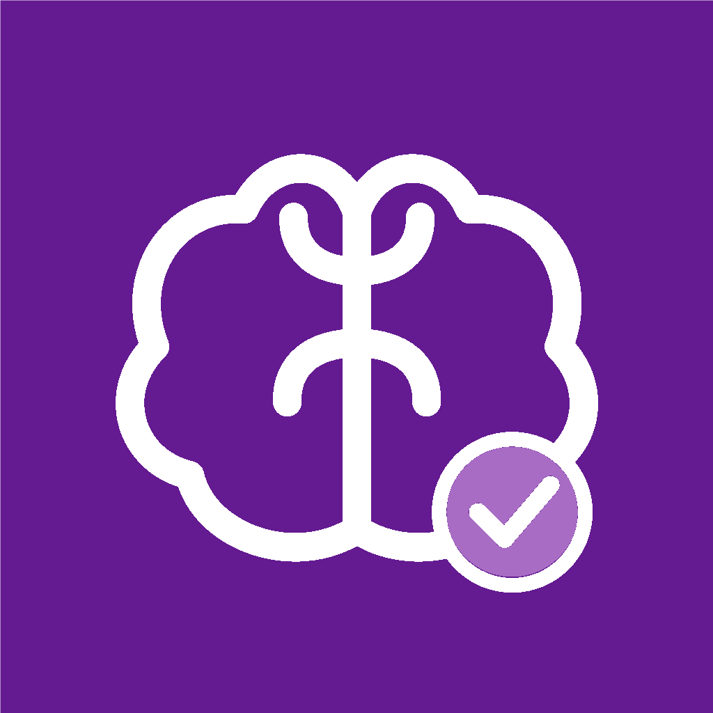

<div align="center">
  

  # CaliMind

  **Make room for what matters.**

  A voice-first daily planner for calmer, more intentional days.

  [](https://github.com/hannsderrick23-debug/CaliMind/releases/latest)
  [](https://github.com/hannsderrick23-debug/CaliMind/actions/workflows/release.yml)
  
  
</div>

## What CaliMind does

CaliMind brings task capture, daily planning, and focused work together in a
mobile app. Add tasks by speaking or typing, organize them around your day, and
adjust your plan as priorities change.

## Features

- **Voice task capture** — speak naturally, review the interpreted task, and
  confirm it before saving.
- **Flexible task management** — create, edit, complete, and organize tasks by
  focus category, due date, priority, duration, and recurrence.
- **Daily scheduling** — generate a proposed schedule, review it, and choose
  what to save. Replan remaining tasks while preserving completed work.
- **Calendar-aware planning** — optionally account for busy calendar intervals
  on supported platforms.
- **Focus sessions** — use a built-in timer to give one task your attention.
- **Progress insights** — review weekly progress and recognize steady effort.
- **Reminders and notifications** — get prompts about tasks and plans.
- **Secure sign-in** — account access, password recovery, and biometric unlock
  where supported.
- **Home-screen widgets** — view useful task information on supported devices.

## Get CaliMind

Download the latest Android APK from
[GitHub Releases](https://github.com/hannsderrick23-debug/CaliMind/releases/latest).
New Android releases are built and published automatically when a `v*` version
tag is pushed.

## Run from source

### Requirements

- Flutter SDK 3.24 or later
- Dart SDK 3.5 or later

### Start the app

```sh
flutter pub get
flutter run
```

## Plan your day

1. Create an account or sign in.
2. Add a task with the microphone or task form. Review voice-captured details
   and confirm before saving.
3. Set a focus category and add details such as priority, duration, due date,
   or recurrence.
4. Open **Schedule**, generate a proposed plan, and review scheduled and
   unscheduled tasks before saving.
5. Start a focus session from a task and check weekly progress as you complete
   work.
6. Configure reminders, calendar access, security, and profile preferences in
   **Settings**.

## Why CaliMind

CaliMind is designed to make planning feel more manageable—not to fill every
minute. Voice capture gets tasks out of your head, schedule review keeps
changes in your hands, and focus sessions help turn a busy list into one clear
next step.

## Built by

CaliMind is developed by **Aventorgo LLC**.

[](https://aventorgo.vercel.app/)

## License

This repository does not currently include a `LICENSE` file. All rights are
reserved by the copyright holder; this README does not grant permission to
reuse, modify, or redistribute the app.
